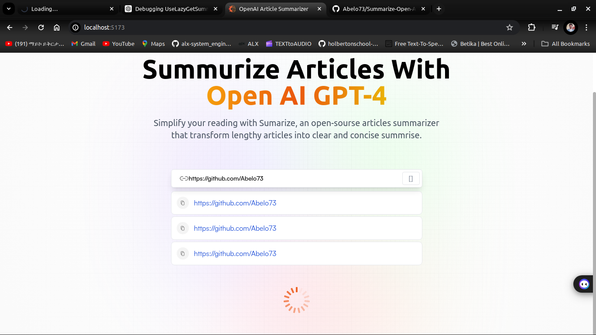

markdown
Copy code
# Summarize Open API

This is a description of my awesome project.

## Screenshot



## Features

- Feature 1
- Feature 2
- Feature 3

## Installation

To install this project, follow these steps:

```bash
git clone https://github.com/Abelo73/Summarize-Open-Api.git
cd Summarize-Open-Api
npm install
